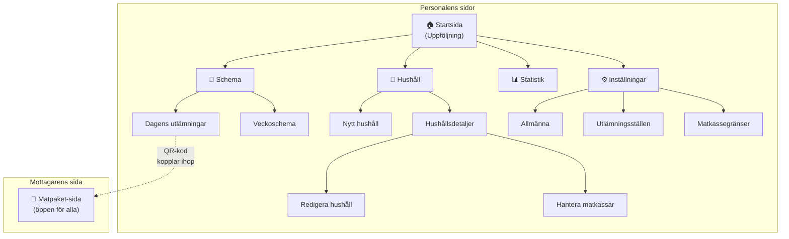
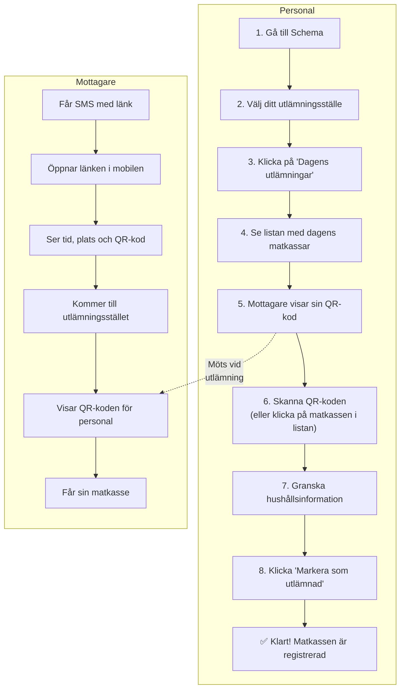
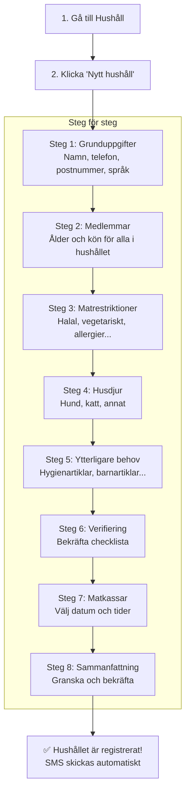
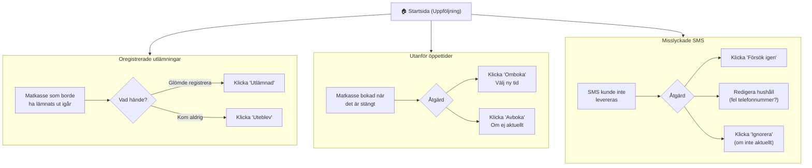
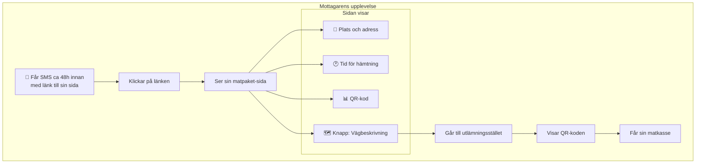

# Matcentralen - Användarguide

Den här guiden visar hur Matcentralen fungerar för personal och mottagare.

---

## Navigationsöversikt

Så här är webbplatsen uppbyggd:

---

## Uppgift 1: Dela ut matkasse

Det här är den vanligaste uppgiften – att lämna ut en matkasse till ett hushåll.

### Vad du ser på skärmen

| Steg | Vad du ser |
|------|------------|
| Dagens utlämningar | Lista med alla matkassar för dagen, visar namn och tid |
| Matkassedialog | Hushållets kontaktinfo, medlemmar, matrestriktioner, husdjur |
| Efter utlämning | Grön bock visar att matkassen är utlämnad |

### Om något går fel

| Situation | Vad du gör |
|-----------|------------|
| Mottagare kommer inte | Klicka "Utebliven" |
| Fel person? | Kontrollera namn och telefonnummer |
| Klickade fel? | Klicka "Ångra utlämning" |

---

## Uppgift 2: Registrera nytt hushåll

När ett nytt hushåll ska få matkassar fyller du i ett formulär i flera steg.

### Tips vid registrering

- **Telefonnummer**: Måste vara svenskt (+46)
- **SMS-samtycke**: Krävs för att kunna skicka påminnelser
- **Dubbletter**: Systemet varnar om telefonnummer redan finns
- **Liknande namn**: Du får en varning om ett liknande hushåll redan finns

---

## Uppgift 3: Hantera problem (Uppföljning)

Startsidan visar saker som behöver åtgärdas.

### Problemtyper i korthet

| Typ | Vad det betyder | Vanlig lösning |
|-----|-----------------|----------------|
| 🟣 Oregistrerad utlämning | En matkasse från igår är inte markerad | Markera som utlämnad eller utebliven |
| 🔵 Utanför öppettider | Matkasse bokad på stängd dag/tid | Omboka till annan tid |
| 🟤 Misslyckat SMS | Meddelandet nådde inte fram | Försök igen eller kontrollera telefonnummer |

---

## Uppgift 4: Mottagarens resa

Så här ser det ut för den som får matkassen.

### Statusar som mottagaren kan se

| Status | Färg | Betydelse |
|--------|------|-----------|
| Planerad | Grå | Väntar på hämtningsdagen |
| Redo för upphämtning | Grön | Dags att hämta! |
| Upphämtad | Blå | Redan hämtad |
| Förfallen | Orange | Tiden har gått ut |
| Inställd | Röd | Avbokad |

### Språkstöd

Mottagaren kan välja bland många språk: svenska, engelska, arabiska, somaliska, ukrainska med flera.

---

## Snabbreferens: Alla sidor

| Sida | Vad du gör där |
|------|----------------|
| **Uppföljning** (Startsida) | Se och åtgärda problem |
| **Schema** | Välj utlämningsställe |
| **Dagens utlämningar** | Lämna ut matkassar, skanna QR |
| **Veckoschema** | Se hela veckans bokningar, omboka |
| **Hushåll** | Sök och visa alla hushåll |
| **Nytt hushåll** | Registrera nytt hushåll |
| **Hushållsdetaljer** | Se all info om ett hushåll |
| **Statistik** | Se diagram och siffror |
| **Inställningar** | Ändra systemkonfiguration |

---

## Tips för vardagen

### Före utdelningen
- [ ] Logga in och gå till "Dagens utlämningar"
- [ ] Kolla om det finns något under "Uppföljning"
- [ ] Ha mobilen redo för QR-skanning

### Under utdelningen
- [ ] Skanna eller klicka på varje matkasse
- [ ] Markera som utlämnad direkt

### Efter utdelningen
- [ ] Hantera eventuella uteblivna
- [ ] Kolla "Uppföljning" nästa dag för missade registreringar

---

*Dokumentet uppdaterat: 2025*
