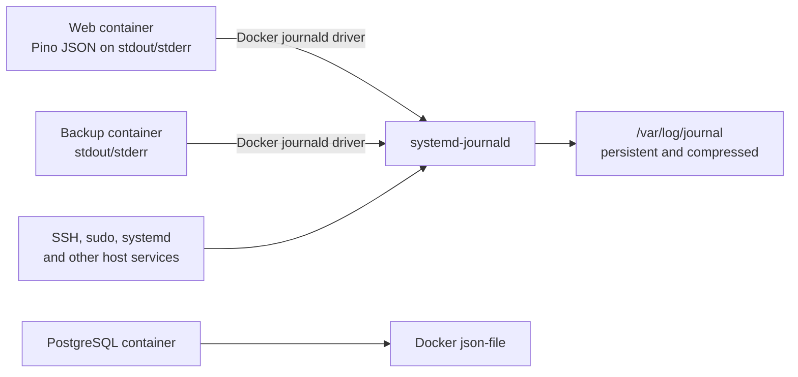

# Log Retention Architecture

## Status

Accepted architecture for production and staging VPS log retention.

## Context

Matkassen application and backup containers originally used Docker's local
`json-file` logging driver. Those files belong to the container, so replacing
and pruning a container during deployment also removes its older logs.

Other records already have separate lifecycles:

- Nginx writes access and error logs below `/var/log/nginx`.
- Deployment output remains in GitHub Actions.
- PostgreSQL backups are encrypted and uploaded to Swift, but those backups do
  not contain application or host-security logs.
- Important SSH, sudo, systemd, and other host-security records exist only in
  the VPS system journal.

The system needs a useful troubleshooting history under normal traffic,
bounded disk consumption, and minimal additional infrastructure.

## Decision

Use the VPS's existing `systemd-journald` service as the durable storage layer
for container output that must survive container replacement.

| Area             | Decision                                                           |
| ---------------- | ------------------------------------------------------------------ |
| Application      | Route the `web` container's standard output and error to journald  |
| Backups          | Route the `db-backup` container's output to journald               |
| PostgreSQL       | Keep the `db` container on its existing `json-file` driver         |
| Host services    | Continue using their existing journald integration                 |
| Nginx            | Continue writing files below `/var/log/nginx`                      |
| Deployments      | Continue retaining workflow output in GitHub Actions               |
| Capacity         | Cap the whole system journal at 2 GB and reserve 5 GB of free disk |
| Time limit       | Do not impose a global age limit                                   |
| Off-host archive | Do not export logs to Swift in this implementation                 |

## System design



Pino records remain JSON inside journald's `MESSAGE` field. Docker adds
metadata such as `CONTAINER_NAME` and `CONTAINER_ID`. A stable container name
allows queries to include entries from previous container instances, while
the changing container ID distinguishes deployments.

Logs written before a container starts using the journald driver are not
migrated and cannot be recovered after Docker removes their old container.

## Host retention policy

The repository manages this journald drop-in:

```ini
[Journal]
Storage=persistent
SystemMaxUse=2G
SystemKeepFree=5G
MaxRetentionSec=0
Compress=yes
```

The 2 GB value is an initial safety ceiling, not preallocated space or a
retention promise. It covers the entire host journal, including security and
application records. It provides incident headroom above the existing host
journal while remaining small relative to the VPS disk. The 5 GB free-space
reserve is the final protection against logs exhausting the host.

The operational target is at least 30 days of history under normal volume.
Actual history can be shorter during a noisy incident because capacity and
free-space limits take precedence. Quiet systems may retain records much
longer.

There is no global time-based deletion rule because it would also remove the
only retained copy of important host-security records. Reassess the 2 GB
ceiling from measured journal growth after application logging is enabled;
investigate unexpectedly noisy sources before increasing it.

## Deployment invariants

The repository-managed journald helper runs from both initial and continuous
deployment before Docker replaces any application container.

It must:

1. Create `/var/log/journal` and let systemd apply its expected ownership,
   modes, and ACLs.
2. Install the drop-in atomically with root ownership and normal configuration
   permissions.
3. Record that a restart is required before replacing the drop-in.
4. Restart journald only when the policy changed or an earlier run did not
   finish applying it.
5. Keep the boot-scoped restart marker until journald is confirmed active.
6. Flush volatile records into persistent storage.
7. Inspect the merged configuration and reject a later conflicting drop-in.
8. Write and read a unique canary from persistent journal files.

A failed installation, restart, configuration check, or canary check aborts
the deployment before container replacement. A retry must finish an
interrupted restart instead of treating matching on-disk content as proof that
the running service loaded it.

Setup must not vacuum or delete existing journal records.

## Rollout and acceptance

The change is intentionally ordered:

1. Remove known sensitive SMS values from application logs.
2. Deploy and verify persistent, bounded host journal storage while all Docker
   services remain on their existing logging drivers.
3. Route `web` and `db-backup` to journald while leaving `db` unchanged.

The host-policy stage must prove on staging and then production that:

- The intended settings are effective.
- A second helper run makes no changes and avoids another restart.
- The persistent canary remains readable.
- Restarting journald does not interrupt Docker, Nginx, SSH, application
  health, or subsequent journal writes.
- Existing history remains available and disk usage remains reasonable.

After changing the Docker drivers, staging must recreate the web container a
second time and prove that an entry from the preceding journald-enabled
container remains queryable. Production promotion is blocked if that
cross-container persistence test fails.

Day-to-day query and troubleshooting commands belong in
`docs/production-logs.md`.

## Security and privacy

Longer retention increases the impact of accidental over-logging. Complete
phone numbers, SMS bodies, credentials, authorization values, session data,
provider callback data, and uncontrolled provider errors must not reach the
application logger.

The journal retains the VPS's existing privileged access model. This design
does not make records publicly accessible, add application secrets, or add a
hosted logging provider.

The retained journal remains local to the VPS. It is not an independent or
tamper-resistant security archive and can be lost with the host.

## Failure handling and rollback

If the container logging-driver change causes an operational issue:

1. Return `web` and `db-backup` to their previous bounded `json-file`
   configuration.
2. Recreate only those services through the normal deployment path.
3. Leave PostgreSQL untouched.

Previously collected journal entries remain available under the host policy
after that rollback.

If the host policy itself causes an issue, stop future deployments from
reinstalling the repository-managed drop-in, remove only that managed file,
and restart journald. Do not automatically delete `/var/log/journal` or vacuum
records. Confirm the remaining effective policy and the health of SSH, Docker,
Nginx, and the application.

## Consequences and trade-offs

- Journald capacity is shared by application and host records.
- High log volume may reduce the available history below 30 days.
- Systemd's default rate limiting may suppress extreme bursts.
- Docker's default blocking delivery behavior can apply backpressure if the
  logging path becomes unhealthy.
- Pino fields are not individually indexed journald fields.
- The design survives container replacement and host reboot, but not VPS loss
  or compromise.
- It avoids another service, credential set, monitoring surface, and ongoing
  operating cost.

An off-host archive should be designed separately if audit, legal, insurance,
incident-response, or host-loss requirements emerge. Such a design would need
separate least-privilege Swift credentials, encryption, lifecycle deletion,
integrity checks, restore testing, privacy review, and upload-failure alerting.

## References

- [Docker journald logging driver](https://docs.docker.com/engine/logging/drivers/journald/)
- [Configure Docker logging drivers](https://docs.docker.com/engine/logging/configure/)
- [systemd journald configuration](https://www.freedesktop.org/software/systemd/man/journald.conf.html)
