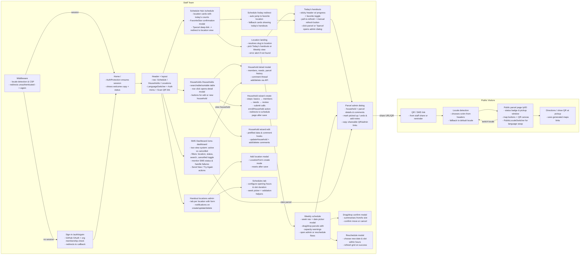

# Matkassen User Journeys

This document captures high-level navigation for both staff and public visitors.

> Tip: install a Mermaid-compatible Markdown preview (e.g. "Markdown Preview Mermaid Support") to render the diagram in VS Code.

